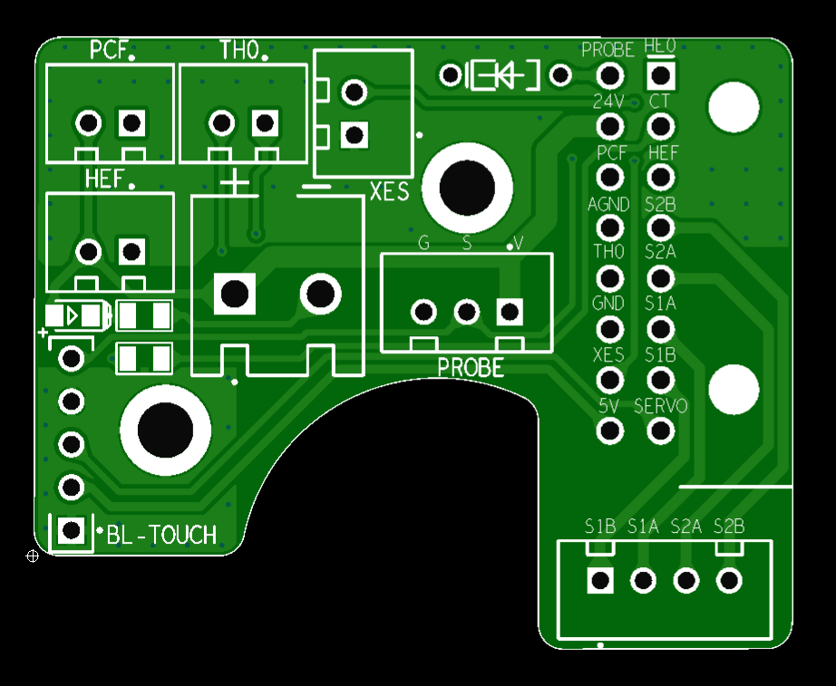
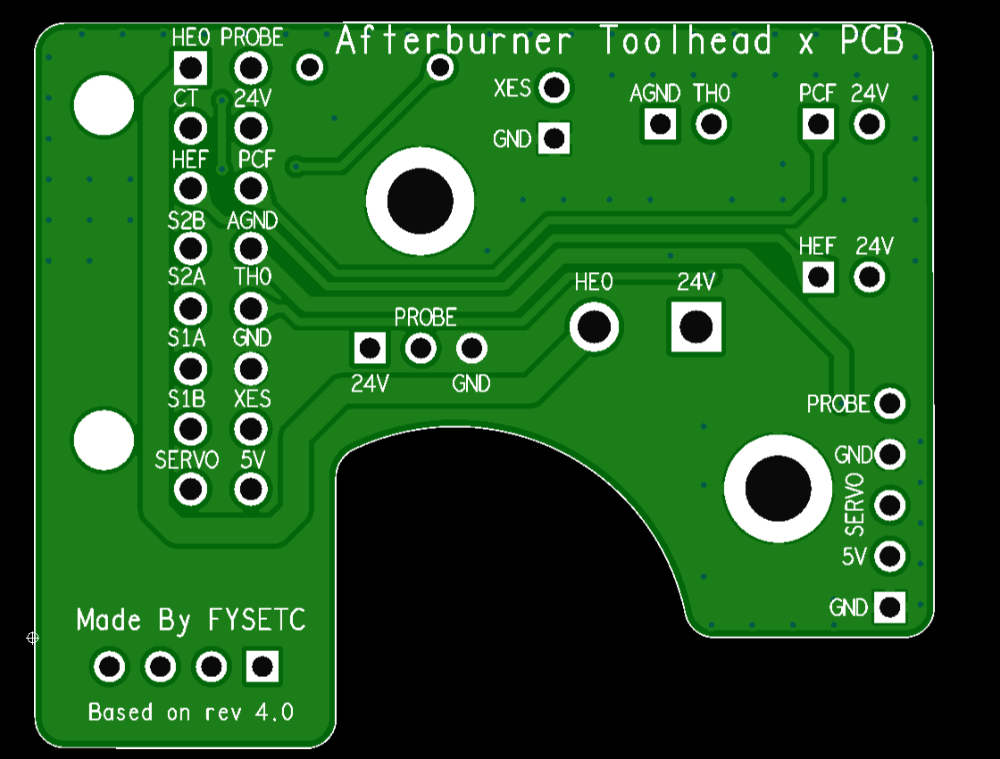

# FYSETC-Afterburner_Toolhead_PCB_x
This PCB is base on VORON [Afterburner_Toolhead_PCB](https://github.com/VoronDesign/Voron-Hardware/tree/master/Afterburner_Toolhead_PCB), and support bltouch or ERCF hall sensor .





```
Pinout 
24V  - HE0 +V 
GND  - PSU -V (NOT MAINS GND)
PROBE/ABL  - Probe Signal Pin
HE0  - Hotend Heater -V
CT   - Chamber Thermistor Signal Pin (TH1)
PCF  - Part Cooling Fan -V
HEF  - Hotend Cooling Fan -V
AGND - Hotend Thermistor -V
TH0  - Hotend Thermistor Signal Pin (TH0)
XES  - X Endstop Signal Pin 
S1A  - Red Stepper Wire
S2A  - Green Stepper Wire
S1B  - Blue Stepper Wire
S2B  - Black Stepper Wire 
5V   - 5V 
SERVO - BLTOUCH PWM/ERCF Hall sensor
```

## config

chamber thermistor config settings

    #######################################
    #### Enclosure Temp Sensor Section ####
    #######################################
    [thermistor chamber_temp]
    temperature1: 25
    resistance1: 10000
    beta: 3950

	[temperature_sensor enclosure_temp]
	sensor_type: chamber_temp
	sensor_pin: PC1 #Spider 2.x connected to TE1
	#sensor_pin: PC1 #S6 2.x connected to TE1
	min_temp: 0
	max_temp: 100
	gcode_id: C

## STLs

We design a cover for clockwork extruder, it is in `STLs` folder. It is base on VORON design part [here](https://github.com/VoronDesign/Voron-Hardware/blob/master/Afterburner_Toolhead_PCB/STLs/Clockwork/Covers/ERCF_pcb_cover_stock_afterburner.stl).

